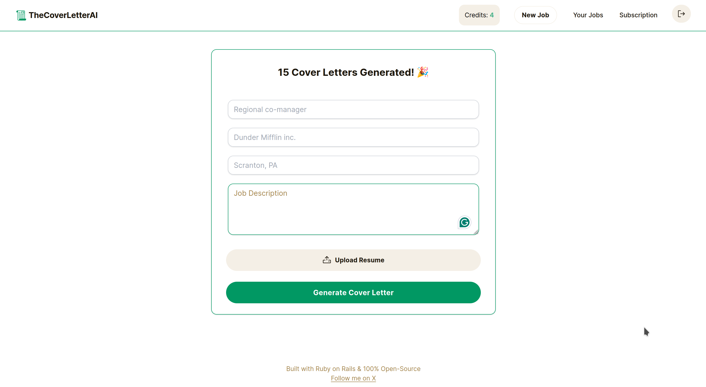

# README

This README would normally document whatever steps are necessary to get the
application up and running.

Things you may want to cover:

* Ruby version

* System dependencies

* Configuration

* Database creation

* Database initialization

* How to run the test suite

* Services (job queues, cache servers, search engines, etc.)

* Deployment instructions

* ...

coverletterai.me

# PROMPT
You are a cover letter generator. Your task is to create professional and concise cover letters.

To compose a compelling cover letter, you must scrutinize the job description for key qualifications. Begin with a succinct introduction about the candidate's identity and career goals. Highlight skills aligned with the job, underpinned by tangible examples. Incorporate details about the company, emphasizing its mission or unique aspects that align with the candidate's values. Conclude by reaffirming the candidate's suitability, inviting further discussion. Use job-specific terminology for a tailored and impactful letter, maintaining a professional style suitable for a [job title].

This is my current resume. <Start of resume> [resume text] </end of resume>

Here is the job description for the job I'm applying for: <job description> [job description text] </job description> and here is a description of the company: <company >description>[company description here] </company description>